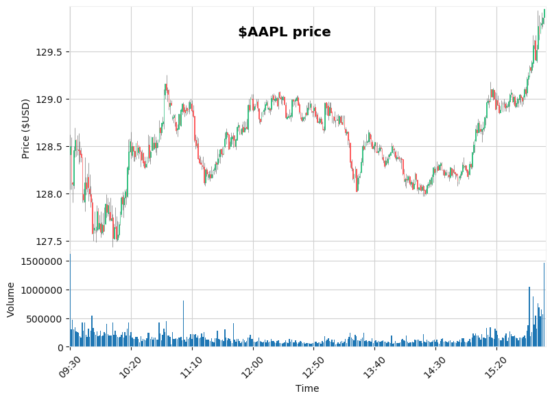
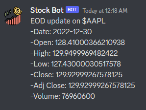
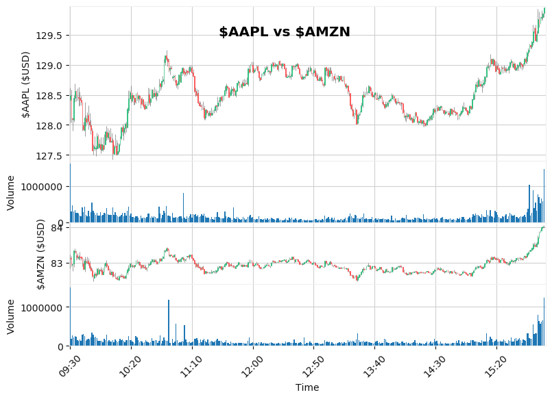
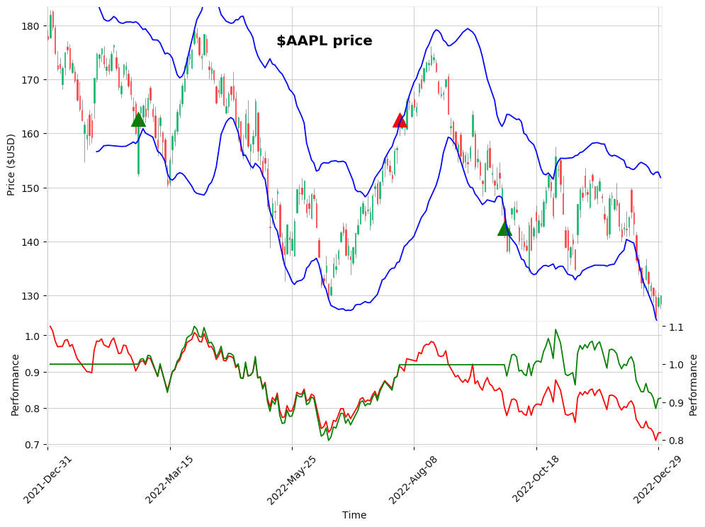
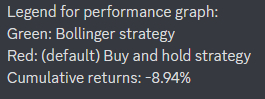

# Discord Trading Bot
A Discord bot that integrates stock analysis functionalities using the `discord.py` library and the `trade` module. This bot enables users to perform various stock analysis tasks, visualize charts, and get information related to stocks within a Discord server environment.

## Introduction

This bot provides users with the ability to interactively perform stock analysis, visualize charts, and get information related to various stocks directly within a Discord server. Leveraging the `trade` module, it offers functionalities to generate charts, compare stocks, fetch End-of-Day (EOD) data, and apply Bollinger Bands strategies.

## How to Use

To use this bot, follow these steps:

1. **Installation:**
   - Clone this repository to your local machine.
   - Install the required libraries by running `pip install -r requirements.txt`.
   - Obtain your Discord bot token and set it in a `.env` file as `DISCORD_TOKEN=your_token_here`.

2. **Running the Bot:**
   - Run the bot using `python bot.py`.

3. **Interacting with the Bot:**
   - Use the provided commands in the Discord server to perform various stock analysis tasks.

## Bot Commands

The bot supports the following commands:

| Command          | Output Images               |
| ---------------- | --------------------------- |
| `$$chart` Generate a chart for a specific stock | |
| `$$EOD` Fetch End-of-Day (EOD) data for a stock | |
| `$$compare` Compare two stocks using charts | |
| `$$bollinger` Apply Bollinger Bands strategy on a specific stock |  |
